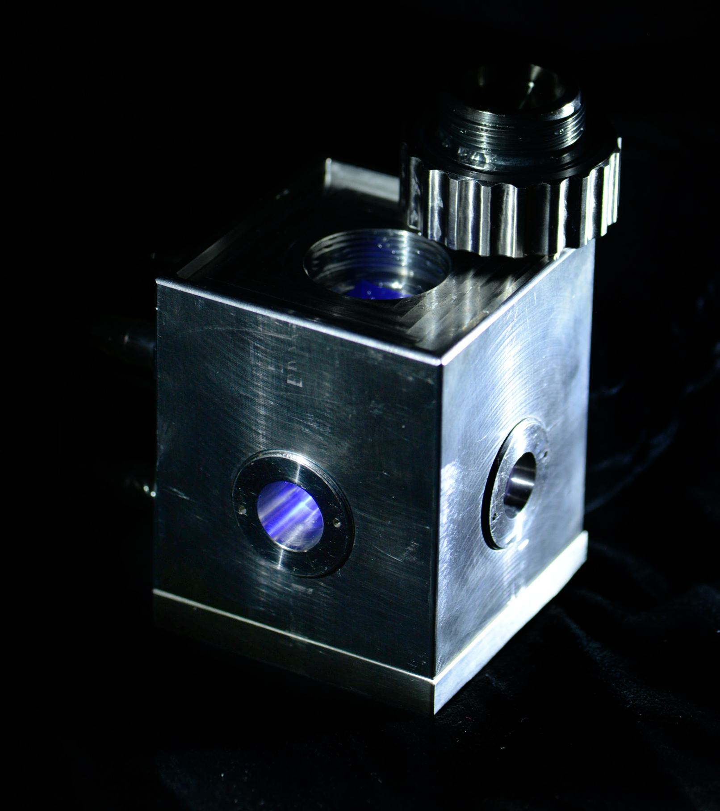

# spectackler

<p float="left">
  
   
</p>

Drivers and software for making spectrophotometric measurements under pressure.

**Teach your old spec new tricks!**

These drivers and interfaces provide an cross-platform, open-source interface for
instruments that previously required proprietary Windows software.

### Suggested use

The [below drivers](#hardware-drivers) are commented and I hope their methods will be self-explanatory. Use my [data collection suites](#data-collection-suites) as application examples, or, if you manage to replicate my setup exactly, use them as-is. Go get 'em (data) and have fun!

## Hardware drivers

Each module implements one device class. You can connect as many instances of the device as you like.

* [(Teledyne) ISCO D-series high-pressure syringe pump `isco260D.py`](#isco260dpy)

* [(Thermo) NESLAB RTE series Digital Plus temperature controller `neslabrte.py`](#neslabrtepy)

* [Fisher Isotemp 6200 temperature controller `isotemp6200.py`](#isotemp6200py)

* [Shimadzu RF-5301PC spectrofluorophotometer `rf5301.py`](#rf5301py)

* [Auxiliary microcontroller for misc functions `amcu.py`](#amcupy)

## Data collection suites

Higher-level scripts are included here that use some or all of the above drivers. A feature of all these programs is that they write __raw__ data to the disk __in real time__. This prevents data loss should the software or computer crash mid-experiment, but it does result in some pretty big text files, since data are recorded at the temporal resolution of the fastest instrument. Data processing and visualization is left to [external scripts](#data-vizualization).

* [Steady-state fluorimetry (e.g. Laurdan)](#viscotheque_laurdanpy)

* [Kinetics](#kinethequepy)

* [Calibration routines](#calibration-routines)

> Note 20220907: These scripts open one main thread, plus a separate polling thread for each instrument. Though I have yet to make all the polling threads close cleanly at the end of an experiment, the experiment itself ends cleanly; i.e. hardware programmed to shut down automatically will do so.

## Data analysis and visualization

* [Laurdan GP `laurdan.R`](#laurdanr) (with `ggplot2`)

* [Kinetic trace `kinetoscope.py`](#kinetoscopepy) (in python)

### isco260d.py

Though I originally wrote this for a model 260D pump, I have been using it unmodified with an 100DM and have yet to experience any issues. 

`iscotest.py` can be used to test your setup with the driver.

The most common culprits for communication problems are:

1. Wrong serial port passed to driver. This is set in the calling script on the computer side.

2. Pump address mismatched between computer and controller. This is the `dest` arg in the `ISCOController` constructor.

3. Baudrate mismatched between computer and controller.

To change the pump address and baudrate on the pump side, [consult the manual](https://github.com/octopode/spectackler/blob/master/manuals/isco_man.pdf).

> Note: for unknown reasons, the `STOPALL` command issued by the `stop()` method does not work on either pump I have used. Recommend using `pause()`, which I built as a workaround. It stores the current setpoint, issues `CLEAR`, then restores the setpoint.

### neslabrte.py

`neslabtest.py` can be used to test your setup with the driver.

Some notes on this version of the driver (as of 20220902):

1. RS485 multidrop functionality is untested. Recommend direct RS232 connection if you
want to use it out of the box.

2. Decoding of the instrument status array (i.e. by `status_get()`) is not quite right. I just used the byte order in the manual. If you figure out the correct one, please share it! Meanwhile I have been getting by just fine in routine applications avoiding the use of `status_get()`.

And a general note on NESLAB waterbaths:

* Unlike some other makes, serial vs. front panel control on a NESLAB bath is __either/or__: once in serial the only button that will function on the temp controller is POWER. Conversely, outside of serial mode, the instrument will not respond to serial signals. To learn which buttons get you in (and if need be, out), of serial mode, see pp. 24 of [the manual.](https://github.com/octopode/spectackler/blob/master/manuals/Thermo-NESLAB_RTE-0series.pdf) The easiest way to hand control back to the front panel is to issue `status_set(remote=False)`.

### isotemp6200.py

`isotemptest.py` can be used to test your setup with the driver.

The isotemp line are solid budget waterbaths. Current models come with a built-in UART but are serial devices at heart. They have a straightforward, if nonstandard, ASCII-based com protocol.

The only issue I have ever had using this driver involves the UART dropping out when connected to an unpowered USB hub.

### rf5301.py

`spectest.py` can be used to test your setup with the driver.

The Shimadzu RF-5301 is not the most modern fluorospec, but these days it's fairly affordable, and its optical bench and noise reduction circuit are sturdy and effective.

The legacy Windows-based control software is `RFPC.exe`. It is a 16-bit program with some functions that rely on an [x87-compatible coprocessor](https://en.wikipedia.org/wiki/X87). You can apply [one of these fixes](https://stackoverflow.com/questions/10511506/old-16-bit-application-causing-gpf-in-win87em-dll-intermittently) to run it on a modern CPU or VM.

Note: Unlike the other instruments here, there is no serial comms protocol available for the RF5301. All the commands implemented here were reverse-engineered by [sniffing](#low-cost-serial-sniffer) RS232 transmissions between the `RFPC` software and the instrument. Two consequences of this:

1. `rf5301.py` cannot do everything `RFPC` can. I only took the time to reverse-engineer functions that I use.

2. As of 20220422, I have not figured out the checksum for this instrument. The helpful folks at Shimadzu couldn't get documentation either. So for now, checkbytes for all operations I use are hardcoded. If you need a wavelength other than those for DPH or Laurdan, or you want to use a function I have not, you have 3 options:

  1. Send the parameter (e.g. wavelengths) to the instrument using RFPC, then switch over to your Python script. Works if the parameter will be the same throughout experiement.
  
  2. [Sniff](#low-cost-serial-sniffer) the checkbyte sent by `RFPC` and hardcode it yourself.
  
  3. Use your superior math abilities to deduce the checksum algorithm. If you succeed, please share!
  
  > As of 20220902, I have a lead on `RFPC` internal documentation. Stay tuned!
  
### amcu.py

Auxiliary MicroController Unit (AMCU) is the fancy name for an Arduino I have hooked up to the system to do odd jobs. As of now, these consist of:

1. Monitoring the humidity and temperature inside the sample chamber for the purpose of estimating dewpoint. A DHT11 sensor package is used.

2. Controlling a tiny reed relay that shuts off the Xenon lamp in the fluorospec once a long-running experiment is complete. Automated lamp control is not a built-in feature of the spec.

`auxtest.py` can be used to test your setup with the driver. To test things on the hardware side, simple ASCII commands can also be sent via a serial console like the one in the Arduino IDE.

`20211230_CubetteAux.ino` is the latest version of the sketch I've been running on the Arduino.

### Low-cost serial sniffer

A byproduct of this project was a cheap and straightforward way to intercept bidirectional RS232 communications. It took me a couple hours to get this solution together, so I'm including it here in hopes it might help someone. A lot of RS232-based lab equipment is still around, and not all of it has well-documented comm protocols.

#### Hardware

1. In addition to whatever's already in your setup, you are going to need __a pair of USB <-> RS232 adaptors__ to dedicate to sniffing. A dual-port adaptor (e.g. StarTech ICUSB2322I) is just as good.

2. _DB9 gender changer and additional cable._ Make sure neither is a [null modem](https://en.wikipedia.org/wiki/Null_modem); the adaptor being used for sniffing will be invisible to the software being sniffed and that software wants to talk to DCE.

Connect as follows:

```
------------------------------
| Computer running legacy SW |
------------------------------
  |
  | (RS232 w/gender changer; ends up F-F)
  |
  |---|-------------------|   (USB*)  |-------------------------------|
      | Dual-port adaptor |-----------| Sniffing computer (runs *NIX) |
  |---|-------------------|           |-------------------------------|
  |
  | (RS232)
  |
---------------------------
| Laboratory Instrument X |
---------------------------
*2x adaptors and 2x USB connections if you use twin single-port adaptors
```

#### Software

This was the tricky bit for me. [`socat`](https://linux.die.net/man/1/socat) is a fantastic utility, but like many UNIX-compatible tools, it's not the most intuitive.

If you use `conda`, installation is as simple as `conda install -c conda-forge socat`.

Then run this magic command:
`socat -x -dd /dev/cu.usbserial-FT4IVKAO0,raw,echo=0,crnl /dev/cu.usbserial-FT4IVKAO1,raw,echo=0,crnl 2>&1`

This will render the sniffing machine "invisible" by relaying all signals through verbatim. It will also print all intercepted data to `stdout`.

Here is the incantation dissected:

+ `/dev/cu.usbserial-FT4IVKAO0`, `/dev/cu.usbserial-FT4IVKAO1`: device handles for the two ports on the sniffing adaptor(s). The setup is bidirectional and so should work even if you switch these addresses.

+ `crnl` is the line ending generally used by Windows.

+ `2>&1` moves `stderr` output to `stdout`. `socat` prints natively to `stderr`.

Once you start communicating with your instrument, the `socat` terminal will spit out bytes in hexadecimal. `socatrans.py` is a gizmo you can use to translate these to their corresponding ASCII characters. If the instrument in question uses an ASCII-based protocol, this can make the commands more intuitive (e.g. the RF5301 uses `SX` and `SM` to Set eX and eM wavelengths).

`socat -x -dd /dev/cu.usbserial-FT4IVKAO0,raw,echo=0,crnl /dev/cu.usbserial-FT4IVKAO1,raw,echo=0,crnl 2>&1 | tee hex.log | socatrans.py | asc.log`

Happy sniffing!

### viscotheque_laurdan.py

This versatile script can be used to make just about any steady-state fluorescence measurement across a range of pressures and temperatures. The experiment parameters are input as a TSV file (see `viscotheque-example-matrix_2ex_11x9.tsv`) and then the instrument goes through the motions. A whole variety of different experiments can be done just by modifying the spreadsheet.

__I recommend composing the input TSV in Google Sheets or Excel, then saving it as a text file to pipe into the script.__

#### Reserved columns in the TSV

+ `P_set`: Pressure setpoint in instrument units (I keep my pump set to bar)

+ `T_set`: Temperature setpoint (°C)

+ `time`: Wait time (s) before beginning data collection for this step

+ `wl_ex`: Fluorescence excitation wavelength (nm)

+ `wl_em`: Fluorescence emission wavelength (nm)

+ `slit_ex`: Excitation slit width AKA bandwidth (nm)

+ `slit_em`: Emission slit width AKA bandwidth (nm)

> All of the above should be float values, but be careful not to exceed the resolution of the associated instrument. For example, if you specify a temp setpoint of 20.05 bar but your temperature controller only measures to 0.1 bar, it may be impossible to reach your setpoint! There's some rounding code in there, but don't rely on it!

+ `n_read`: Number of fluorescence readings to take for this step. The RF5301 does not do any averaging internally, so data are always collected at the highest possible frequency and averaged on the computer side to control noise. The higher this value is set, the more values will be available for averaging.

> This needs to be an integer.

#### Unreserved columns

`state`, `msg`, etc., and any other columns you care to include, will simply be copied into the output file for the duration of each step and can be used to aid post-processing. Bear in mind that including a lot of text in these columns will disproportionately enlarge the output file. There is _no_ compression! 

### kinetheque.py

This program records fluorescence intensity through time with provision for a pressure jump during the experiment. At present it's a fairly quick-and-dirty script: pressure setpoints are hardcoded and the temperature controller thread is omitted for simplicity. My kinetics experiments are at constant temp, so programmatic temperature control and tracking is not important.

It's easy to adapt this program for a linear temperature ramp: the best strategy I have found is to put the pump in `pGa` (pressure gradient) mode, enter the desired gradient using the front panel, then remove the `press_set()` calls in the script so that `pump.run()` just starts the gradient. Per the manual, it is theoretically possible to enter gradient programs via serial, but I have yet to make this work.

### Calibration routines

It has occasionally been necessary to run experiments that quantify instrument parameters. I have included quick utility scripts for a few of these:

+ `thermocycle.py` runs the temperature controller through a TSV-specified program while recording internal and external RTD temperatures, plus a reference temp from a NIST-traceable QTI device. Used to calibrate temperature inside the pressure chamber.

+ `neslab_cal_sweep` is similar to `thermocycle` but adapted slightly for the NESLAB temperature controller.

+ `pressrecord.py` is a simple polling script that logs pressure, pump flowrate, and cylinder volume to a file. Like other data collection scripts here, it records elapsed time and date/time from the system clock. Handy for documenting simple pressure incubations or system integrity tests.

+ `flowrateTest.py` is used to determine how quickly the pressure can be ramped before an unacceptable pressure difference develops between the pump cylinder and the optical cell. This can be thought of as a practical measure of resistance in the pressure plumbing. It ramps between a (hardcoded) set of pressures at a (hardcoded) set of flowrates. When the experiment is complete, it is up to you to inspect the pressure trace and see how much it settles after the pump is stopped under each set of conditions. This information is useful for capping the flowrate in a kinetic experiment and for determining appropriate wait times in a steady-state protocol.

### laurdan.R

Takes in one or more raw output files from (`viscotheque_laurdan.py`)[#viscotheque_laurdanpy]. Simultaneously outputs a trace of the pressure chamber in P-T space and a contour plot of laurdan GP, which is calculated from the raw fluorescence data. The infinite loop at the end of the script can be used for continuous monitoring of an experiment in progress. Point the R script to the raw data file(s), then point an auto-refreshing PDF viewer like [Skim](https://skim-app.sourceforge.io/) to the script's output file. This will produce something like the image you see at the top of this readme.

> Needs to be pushed as of 20220907.

### kinetoscope.py

Takes in raw output file from (`kinetheque.py`)[#kinethequepy] and provides a simple strip chart of fluorescence in real time. A dead-simple application of the (`oscilloscope` package)[https://pypi.org/project/oscilloscope/]. Look inside the script for parameters you might want to change.